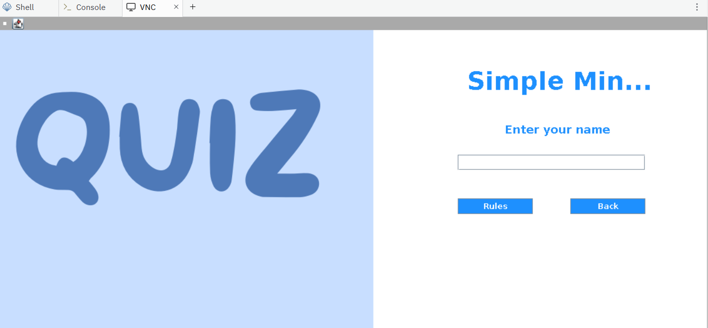
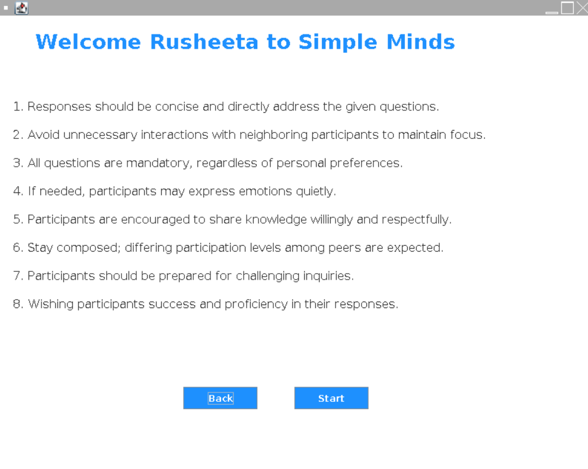
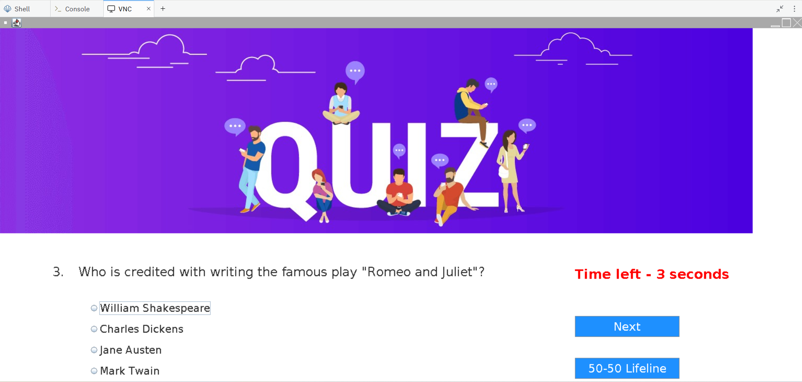

# Quiz Game

## Description
This is a Quiz Application built using Java with a graphical user interface (GUI). The application allows users to log in, view quiz rules, and take quizzes, displaying the user's score at the end.

## Features
-- User login interface with name entry
- 10-question multiple choice quiz
- 50-50 lifeline to eliminate two incorrect options
- Timer-based question display (partial implementation)
- Final score display

## Technologies Used
- **Programming Language**: Java

## Project Structure
The project is structured as follows:
```
Quiz-Application-Using-Java-master/
│
├── src
│ └── quiz
│ └── application
│ ├── Login.java
│ ├── Rules.java
│ └── Score.java

```
- **Login.java**: Contains the login interface for the quiz application.
- **Rules.java**: Displays the rules of the quiz.
- **Score.java**: Shows the user's score after completing the quiz.

## How to Run
1. Clone or download the repository.
2. Open the project in your preferred Java IDE.
3. Ensure the image resources (like `login.png`, `quiz.jpg`) are in the `/icons` directory inside your project `src` folder.
4. Compile and run the `Login.java` file.
5. Enter your name and click "Rules" to start the quiz.

## Usage
To run the application, follow these steps:

1. **Compile the Java files**:
   Navigate to the project directory in your shell and run:
   ```bash
   cd "Quiz-Application-Using-Java-master"
   javac src/quiz/application/*.java
    ```
2. **Run the application**:
   After compiling, run the `Login` class:
   ```bash
   java -cp src quiz.application.Login
   ```
After compiling, you can start the application with:
## Screenshot




